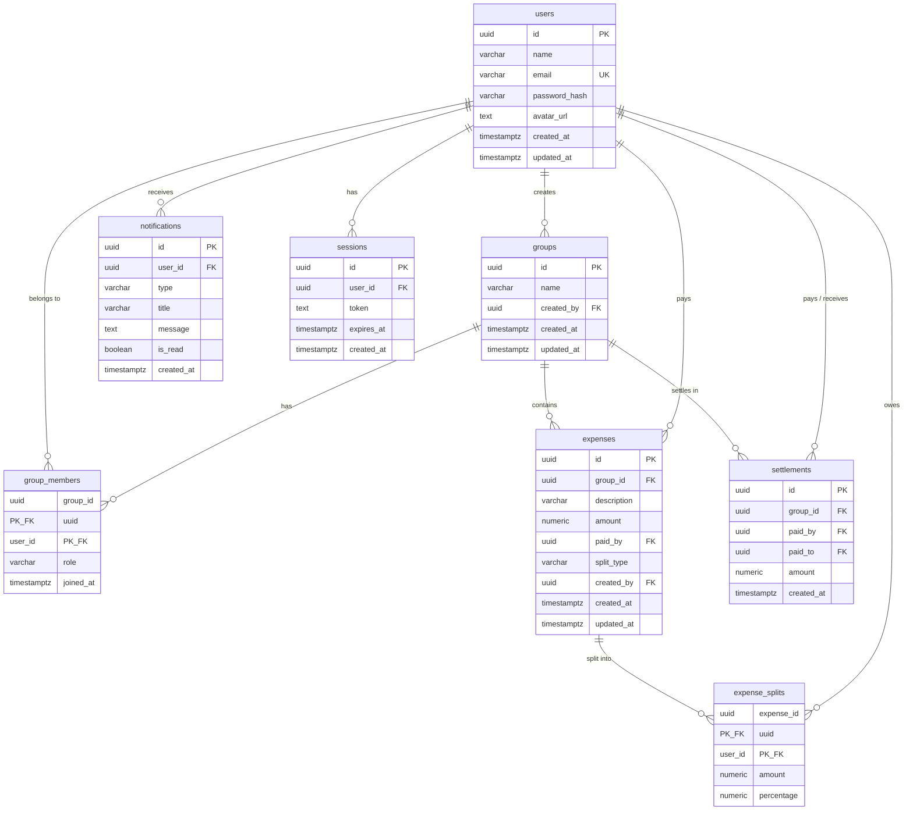

# 💸 SplitWiseX — Expense Splitter

A full-stack expense splitting application inspired by Splitwise. Create groups, add shared expenses, split costs using multiple strategies, track balances, settle debts, and stay notified — all in real time.

---

## 📋 Table of Contents

- [Features](#-features)
- [Tech Stack](#-tech-stack)
- [Architecture](#-architecture)
- [Database Schema](#-database-schema)
- [API Reference](#-api-reference)
- [Getting Started](#-getting-started)
- [Project Structure](#-project-structure)
- [Environment Variables](#-environment-variables)
- [Scripts](#-scripts)
- [License](#-license)

---

## ✨ Features

### Authentication & Security
- **User Registration & Login** — Secure sign-up and sign-in with email and password.
- **JWT Authentication** — Stateless token-based auth using HTTP-only cookies.
- **Password Hashing** — Passwords are hashed with bcrypt before storage.
- **Protected Routes** — All app routes are guarded on both client and server.
- **Input Validation** — Request payloads validated with Zod schemas.
- **Security Headers** — Helmet middleware for HTTP security headers.

### Groups
- **Create Groups** — Organize expenses under named groups.
- **Member Management** — Add or remove members by email. Role-based access (Owner / Member).
- **Group Dashboard** — View all groups at a glance with balance summaries.

### Expenses
- **Add Expenses** — Log shared expenses with a description, amount, and payer.
- **Flexible Splitting** — Split costs three ways:
  | Split Type   | Description                                      |
  |-------------|--------------------------------------------------|
  | **Equal**       | Divide evenly among selected participants         |
  | **Exact**       | Assign specific amounts to each participant       |
  | **Percentage**  | Assign percentage shares (must total 100%)        |
- **Edit & Delete** — Update or remove any expense you created.
- **Expense Details** — View the full breakdown of who paid and who owes.

### Balances & Settlements
- **Real-time Balances** — See who owes whom within each group.
- **Net Balance Calculation** — Optimised balance computation across all group expenses.
- **Record Settlements** — Log payments between members to clear debts.
- **Settlement History** — Track all past settlements in a group.

### Dashboard & Analytics
- **Personal Dashboard** — Overview of total "you owe" and "you are owed" across all groups.
- **Recent Activity** — Quick view of the latest expenses.
- **Group Analytics** — Per-group stats including:
  - Total expenses count & total amount
  - Average, highest, and lowest expense
  - Member-wise spending breakdown

### Notifications
- **In-app Notifications** — Receive alerts for new expenses, settlements, and group updates.
- **Mark as Read** — Mark individual or all notifications as read.
- **Delete Notifications** — Remove notifications you no longer need.
- **Optimistic UI Updates** — Instant UI feedback with server reconciliation.

---

## 🛠 Tech Stack

### Frontend

| Technology | Purpose |
|---|---|
| **React 19** | UI library for building component-driven interfaces |
| **Vite 8** | Lightning-fast build tool and dev server |
| **React Router v7** | Client-side routing with nested layouts |
| **Zustand** | Lightweight, hooks-based global state management |
| **Tailwind CSS v4** | Utility-first CSS framework for rapid styling |
| **Axios** | Promise-based HTTP client for API communication |
| **React Hook Form** | Performant, flexible form handling with validation |
| **Recharts** | Composable charting library for data visualisation |
| **Socket.IO Client** | Real-time, bidirectional event-based communication |

### Backend

| Technology | Purpose |
|---|---|
| **Node.js** | JavaScript runtime for server-side execution |
| **Express 5** | Minimal, fast web framework for REST APIs |
| **PostgreSQL** | Robust relational database for structured data |
| **node-postgres (pg)** | PostgreSQL client for Node.js |
| **JSON Web Tokens** | Stateless authentication via signed tokens |
| **bcrypt** | Secure password hashing |
| **Zod** | TypeScript-first schema validation for request data |
| **Helmet** | Security middleware for HTTP headers |
| **cookie-parser** | Parse and set HTTP cookies |
| **dotenv** | Load environment variables from `.env` files |
| **Nodemon** | Auto-restart server on file changes (dev) |

---

## 🏗 Architecture

```
┌─────────────────┐        HTTP / REST        ┌─────────────────────┐
│                 │  ◄───────────────────────► │                     │
│   React SPA     │       (Axios + Cookies)    │   Express API       │
│   (Vite)        │                            │   /api/v1/*         │
│                 │        Socket.IO           │                     │
│   Port 5173     │  ◄───────────────────────► │   Port 5000         │
│                 │                            │                     │
└─────────────────┘                            └────────┬────────────┘
                                                        │
                                                        │ node-postgres
                                                        │
                                               ┌────────▼────────────┐
                                               │                     │
                                               │   PostgreSQL        │
                                               │   Database          │
                                               │                     │
                                               └─────────────────────┘
```

The backend follows a **layered architecture** for clean separation of concerns:

```
Routes  →  Controllers  →  Services  →  Repositories  →  Database
                ↑
           Middleware (Auth)
                ↑
           Validators (Zod)
```

- **Routes** — Define API endpoints and wire up middleware.
- **Controllers** — Handle HTTP request/response; delegate logic to services.
- **Services** — Business logic layer (split calculations, balance computation, notifications).
- **Repositories** — Data access layer; raw SQL queries via `pg`.
- **Middleware** — JWT verification, request authentication.
- **Validators** — Zod schemas for input validation.

---

## 🗄 Database Schema

The PostgreSQL database uses **UUIDs** as primary keys and **timestamptz** for all timestamps.



---

## 📡 API Reference

All endpoints are prefixed with `/api/v1`. Protected routes require a valid JWT in the `token` cookie.

### Health
| Method | Endpoint | Description |
|--------|----------|-------------|
| `GET` | `/health` | Server health check |

### Authentication
| Method | Endpoint | Description |
|--------|----------|-------------|
| `POST` | `/auth/register` | Register a new user |
| `POST` | `/auth/login` | Log in and receive JWT cookie |
| `GET` | `/auth/me` | Get current authenticated user |
| `POST` | `/auth/logout` | Log out and clear cookie |

### Groups
| Method | Endpoint | Description |
|--------|----------|-------------|
| `POST` | `/groups` | Create a new group |
| `GET` | `/groups` | List all groups for current user |
| `GET` | `/groups/:groupId` | Get group details |
| `POST` | `/groups/:groupId/members` | Add a member to a group |
| `GET` | `/groups/:groupId/members` | List group members |
| `DELETE` | `/groups/:groupId/members/:userId` | Remove a member |

### Expenses
| Method | Endpoint | Description |
|--------|----------|-------------|
| `POST` | `/groups/:groupId/expenses` | Create an expense |
| `GET` | `/groups/:groupId/expenses` | List group expenses |
| `GET` | `/groups/:groupId/expenses/:expenseId` | Get expense details |
| `PUT` | `/groups/:groupId/expenses/:expenseId` | Update an expense |
| `DELETE` | `/groups/:groupId/expenses/:expenseId` | Delete an expense |

### Balances
| Method | Endpoint | Description |
|--------|----------|-------------|
| `GET` | `/groups/:groupId/balances` | Get balances for a group |

### Settlements
| Method | Endpoint | Description |
|--------|----------|-------------|
| `POST` | `/groups/:groupId/settlements` | Record a settlement |
| `GET` | `/groups/:groupId/settlements` | List group settlements |

### Analytics
| Method | Endpoint | Description |
|--------|----------|-------------|
| `GET` | `/groups/:groupId/analytics` | Get group spending analytics |

### Notifications
| Method | Endpoint | Description |
|--------|----------|-------------|
| `GET` | `/notifications` | List all notifications |
| `PATCH` | `/notifications/:id/read` | Mark a notification as read |
| `PATCH` | `/notifications/read-all` | Mark all notifications as read |
| `DELETE` | `/notifications/:id` | Delete a notification |

---

## 🚀 Getting Started

### Prerequisites

- **Node.js** ≥ 18
- **npm** ≥ 9
- **PostgreSQL** ≥ 14

### 1. Clone the Repository

```bash
git clone https://github.com/shubhamChaurasia55/SplitWiseX.git
cd SplitWiseX
```

### 2. Set Up the Database

Create a PostgreSQL database and run the migration files in order:

```bash
# Connect to PostgreSQL
psql -U postgres

# Create the database
CREATE DATABASE expense_splitter;
\c expense_splitter

# Run migrations (in order)
\i database/migrations/001_create_users.sql
\i database/migrations/002_create_groups.sql
\i database/migrations/002_create_sessions.sql
\i database/migrations/004_create_expenses.sql
\i database/migrations/005_add_expense_indexes.sql
\i database/migrations/006_add_created_by_to_expenses.sql
\i database/migrations/007_create_settlements.sql
\i database/migrations/008_create_notifications.sql
```

### 3. Configure the Server

```bash
cd server
cp .env.example .env
```

### 4. Install Dependencies & Start

**Server** (Terminal 1):
```bash
cd server
npm install
npm run dev
```

**Client** (Terminal 2):
```bash
cd client
npm install
npm run dev
```

The app will be available at **http://localhost:5173**.

---

## 📁 Project Structure

```
expense-splitter/
├── client/                         # React frontend
│   ├── public/                     # Static assets
│   ├── src/
│   │   ├── api/                    # API client modules
│   │   │   ├── client.js           # Axios instance configuration
│   │   │   ├── auth.api.js         # Auth endpoints
│   │   │   ├── groups.api.js       # Group endpoints
│   │   │   ├── expenses.api.js     # Expense endpoints
│   │   │   ├── settlements.api.js  # Settlement endpoints
│   │   │   ├── notifications.api.js# Notification endpoints
│   │   │   ├── analytics.api.js    # Analytics endpoints
│   │   │   └── health.api.js       # Health check
│   │   ├── components/             # Reusable UI components
│   │   │   ├── AddExpenseModal.jsx  # Modal for creating expenses
│   │   │   ├── GroupBalances.jsx    # Balance display component
│   │   │   ├── GroupExpenses.jsx    # Expense list component
│   │   │   ├── GroupSettlements.jsx # Settlement list component
│   │   │   ├── ProtectedRoute.jsx  # Auth guard wrapper
│   │   │   └── RecordSettlementModal.jsx
│   │   ├── layouts/
│   │   │   └── AppLayout.jsx       # Main app shell (sidebar + nav)
│   │   ├── pages/                  # Route-level page components
│   │   │   ├── Dashboard.jsx       # Home dashboard
│   │   │   ├── Groups.jsx          # Groups listing
│   │   │   ├── GroupDetails.jsx    # Single group view
│   │   │   ├── GroupMembers.jsx    # Member management
│   │   │   ├── GroupAnalytics.jsx  # Group spending analytics
│   │   │   ├── ExpenseDetails.jsx  # Single expense breakdown
│   │   │   ├── Notifications.jsx   # Notification center
│   │   │   ├── Login.jsx           # Login page
│   │   │   └── Register.jsx        # Registration page
│   │   ├── stores/                 # Zustand state stores
│   │   │   ├── auth.store.js       # Auth state & actions
│   │   │   ├── group.store.js      # Group state & actions
│   │   │   └── notification.store.js
│   │   ├── App.jsx                 # Root component with routing
│   │   ├── main.jsx                # Entry point
│   │   └── index.css               # Global styles
│   ├── index.html
│   ├── vite.config.js
│   └── package.json
│
├── server/                         # Express backend
│   ├── src/
│   │   ├── config/                 # Database & app configuration
│   │   ├── controllers/            # Request handlers
│   │   │   ├── auth.controller.js
│   │   │   ├── group.controller.js
│   │   │   ├── expense.controller.js
│   │   │   ├── balance.controller.js
│   │   │   ├── settlement.controller.js
│   │   │   ├── notification.controller.js
│   │   │   └── analytics.controller.js
│   │   ├── middleware/
│   │   │   └── auth.middleware.js   # JWT verification
│   │   ├── repositories/           # Data access (SQL queries)
│   │   ├── routes/                 # Express route definitions
│   │   ├── services/               # Business logic layer
│   │   │   ├── auth.service.js
│   │   │   ├── group.service.js
│   │   │   ├── expense.service.js  # Split calculation logic
│   │   │   ├── balance.service.js  # Net balance computation
│   │   │   ├── settlement.service.js
│   │   │   ├── notification.service.js
│   │   │   └── analytics.service.js
│   │   ├── utils/                  # Helper utilities
│   │   ├── validators/             # Zod validation schemas
│   │   ├── app.js                  # Express app setup
│   │   └── server.js               # Server entry point
│   ├── .env.example
│   └── package.json
│
├── database/
│   └── migrations/                 # SQL migration files (run in order)
│       ├── 001_create_users.sql
│       ├── 002_create_groups.sql
│       ├── 002_create_sessions.sql
│       ├── 004_create_expenses.sql
│       ├── 005_add_expense_indexes.sql
│       ├── 006_add_created_by_to_expenses.sql
│       ├── 007_create_settlements.sql
│       └── 008_create_notifications.sql
│
├── .gitignore
└── README.md
```

---

## ⚙️ Environment Variables

### Server (`server/.env`)

| Variable | Description | Default |
|----------|-------------|---------|
| `PORT` | Port the Express server listens on | `5000` |
| `DATABASE_URL` | PostgreSQL connection string | — |
| `CLIENT_URL` | Frontend origin for CORS | `http://localhost:5173` |
| `JWT_SECRET` | Secret key for signing JWTs | — |

---

## 📜 Scripts

### Client

| Command | Description |
|---------|-------------|
| `npm run dev` | Start Vite dev server on port 5173 |
| `npm run build` | Build production bundle |
| `npm run preview` | Preview production build |
| `npm run lint` | Run ESLint |

### Server

| Command | Description |
|---------|-------------|
| `npm run dev` | Start with Nodemon (hot reload) |
| `npm start` | Start in production mode |

---


---

<p align="center">
  Built with ❤️ by <a href="https://github.com/shubhamChaurasia55">Shubham Chaurasia</a>
</p>
